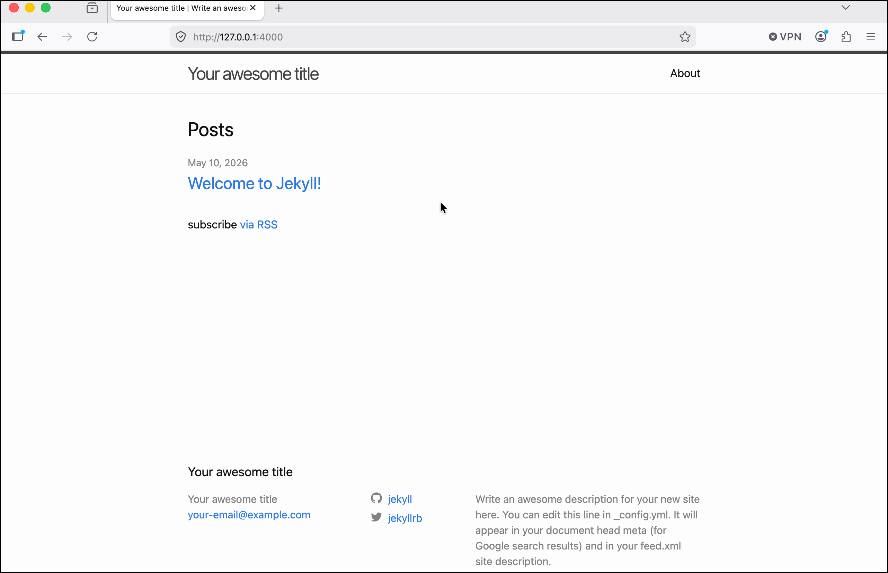

# Start Your First Jekyll Site

Now that your computer has a working Jekyll installation, you are ready to start creating your first static site using Jekyll, Git, and Markdown.

## Create the Jekyll Site

1. Open your Terminal application and navigate to the location where you want to create the directory for your Jekyll site. For this example, I will use the Desktop.
2. Type `jekyll new`, and the name of your website project. For me, that's `jekyll new learning-jekyll`.
3. This may take a little while as Jekyll runs a bundle install. The last line of output should be `New jekyll site installed in ~/Desktop/learning-jekyll`.
4. Change into the new directory and list its contents: `cd learning-jekyll && ls -al`:

```tree
.
├── _config.yml
├── _posts
│   └── 2026-05-10-welcome-to-jekyll.markdown
├── 404.html
├── about.markdown
├── Gemfile
├── Gemfile.lock
└── index.markdown
```

5. These files and folders are the basis of your Jekyll project, complete with a 404 page, an About page, and an index page. The `_posts` folder contains blog posts, and you have a starter blog post with today's date and `-welcome-to-jekyll` in the filename.

## Start Tracking Your Project with Git

Now you're going to run some basic Git commands to start tracking the project.

1. From within the folder you created for the project: `git init`, after which you should see `Initialized empty Git repository in ~/Desktop/learning-jekyll/.git/`.
2. Type `git status`, which should return:

```bash
On branch master

No commits yet

Untracked files:
  (use "git add <file>..." to include in what will be committed)
 .gitignore
 404.html
 Gemfile
 Gemfile.lock
 _config.yml
 _posts/
 about.markdown
 index.markdown

nothing added to commit but untracked files present (use "git add" to track)
```

3. To add all these files to your Git project and track them, `git add .` (the period specifies the files in your present working directory).
4. Now `git status` returns your tracked files:

  ```bash
  $ git status
  On branch master

  No commits yet

  Changes to be committed:
    (use "git rm --cached <file>..." to unstage)
  new file:   .gitignore
  new file:   404.html
  new file:   Gemfile
  new file:   Gemfile.lock
  new file:   _config.yml
  new file:   _posts/2026-05-10-welcome-to-jekyll.markdown
  new file:   about.markdown
  new file:   index.markdown
  ```

5. At this time I am going to commit these to my git project: `git commit -m "Initial commit for learning-jekyll project"`.

## Preview Your New Jekyll Site

You can also preview the website as it looks now. You will need to do this going forward as you make changes, adding posts, pages, text, and images.

1. Jekyll comes with a web server ("Jekyll Serve") that you can use to run and preview the site locally. While Jekyll Serve is running, the shell you use to run it (either a tab or window in your terminal application) will be unavailable for further commands. So open a new tab or window in your terminal application.
2. Type `bundle exec jekyll serve` and press `Enter`.
3. At the end of the output the final two lines should read:

```bash
  Server address: http://127.0.0.1:4000/
  Server running... press ctrl-c to stop.
```

4. Copy and paste `http://127.0.0.1:4000/` into your browser and press `Enter`.
5. You can now preview and navigate your locally hosted Jekyll site.

  * For example, clicking **Welcome to Jekyll!** will take you to that default blog post with some introductory text about creating more blog posts.

6. You can press `Ctrl + C` to exit the Jekyll Serve process.

## Choose and Install a Jekyll Theme

Although you can customize your site using Syntactically Awesome Style Sheets (SASS), Jekyll has a number of looks, or themes, for your website right out of the box. You can search for them across the internet. Some are free and some you need to pay for. One place to start is on Jekyll's own website at [https://jekyllrb.com/docs/themes/](https://jekyllrb.com/docs/themes/){:target="_blank"}.

The two most common ways to install somebody else's theme is to fork a GitHub repository or install it as a Ruby Gem (just like you installed Jekyll itself).

Jekyll themes aren't something I have spent much time learning about, so for this project I am going to use the same theme I am already using on this website. The theme is called [Just the Docs and is available on GitHub](https://github.com/just-the-docs){:target="_blank"}.

Installing the new theme involves editing your site's Gemfile, which is an essential configuration file that Ruby uses to manage the application, in this case Jekyll. You saw the `Gemfile` when you first listed the contents of your Jekyll site's folder.

1. Open `Gemfile` in a code editor of your choice. About halfway down the file (line 11 in my case), you should see this text:

    ```yaml
    # This is the default theme for new Jekyll sites. You may change this to anything you like.
    gem "minima", "~> 2.5"
    ```

2. This is where the theme is declared as Minima. To replace this theme with Just the Docs or another theme of your choice, comment this line out by prepending `gem "minima", "~> 2.5"` with a `#`.
3. Create a new line below this and type `gem "just-the-docs"`, then save `Gemfile`.
4. Now you need to open another very important configuration file for your Jekyll site, `_config.yml`.
5. Starting after all the commented-out instructions at the top of `_config.yml` you will see several properties that allow you to personalize the default website, adding a site `title`, `description`, `url`, and more. (For me, these started at line 21.) About 10 lines down there is another line that is commented out, `# Build settings`, and below that
`theme: minima`. Replace `minima` with the name of the theme you want to use. For me, that's `theme: just-the-docs`.
6. Save `_config.yml`. (Make sure you have saved the changes to both `Gemfile` and `_config.yml`.)
7. To complete setting up the new theme, return to the command line. As long as your present work directory (where you "are" on the command line shell) is within your Jekyll project (in this example, within the `learning-jekyll` directory), type `bundle` and press `Enter`.
8. Check the output you will see the output display messages about `Fetching` and `Installing just-the-docs`.
9. If you have not already stopped `jekyll serve`, stop it with a `Ctrl + C` and enter the command `bundle update` to update the changes you have made. 
10. Now run `bundle exec jekyll serve` again.
11. In your browser, reload the page that you last used to view the website. You will see that the new theme has been implemented and your site has a new look.


Now that you've learned some basics about working with Jekyll and managing it through Git, I'll provide a little more detail about how to [Build Content for Your First Jekyll Site]().