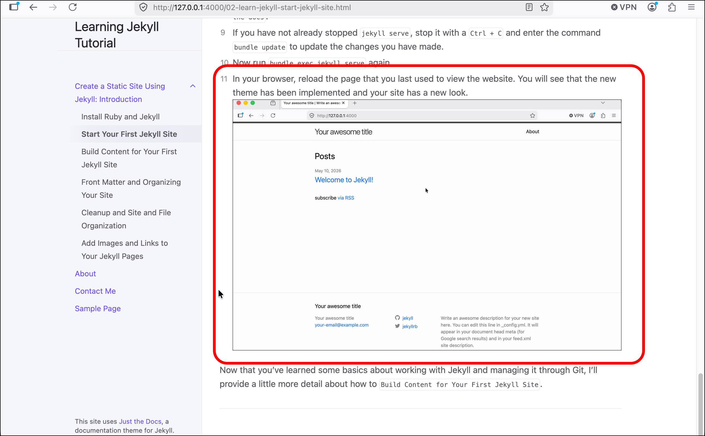
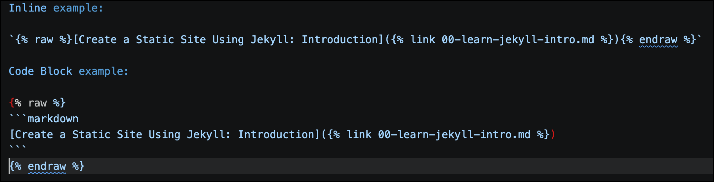
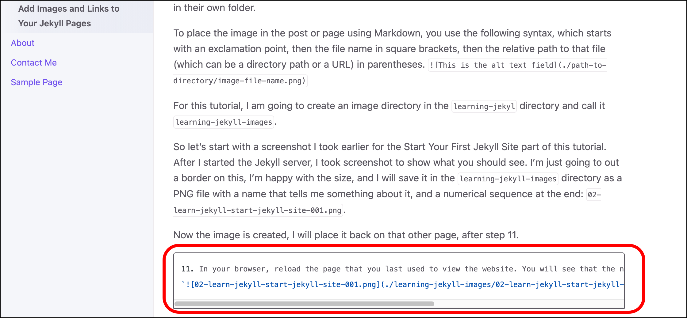
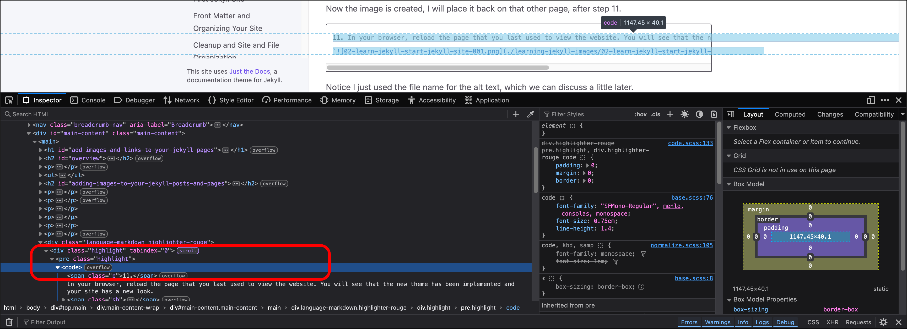
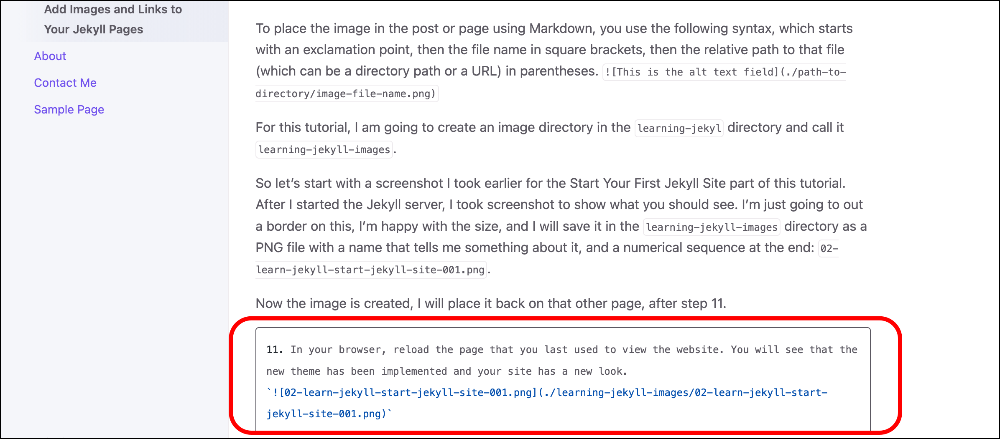

# Add Images, Links, amd More to Your Jekyll Pages

## Overview

This is not an in-depth course on Jekyll. This site you are looking at represents the entirety of my Jekyll experience, so in the spirit of keeping it basic, I'm only going to show you what I needed to create what you are looking at.

* Images
* Hyperlinks
* Basic SASS/CSS Changes
* Adding Google Analytics

## Adding Images to Your Jekyll Posts and Pages

As somebody who is (or was) an avid hobbyist photographer, I had a lot of affinity for doing things in Adobe Photoshop and in the last several years I have become a big fan of Adobe Lightroom Classic. So when I first encontered Snagit, I was not impressed. I was wrong. As somebody who does this , I like to joke that screenshots are the "bread and circuses of tech writing," and I suspect that some people have told me that they love my documentation, but have probably never read it, but just like the presentation and the screenshots. And Snagit helps me accomplish that. I don't know why I am turning this into a promotion for Snagit, but...

I take a screenshot, size it, add a 1px black border, and I use callouts like the red outline, usually 5 or 6px with some border radius in the corners. Once I have captured and edited my images in Snagit, I save them with a common file name format, usually with an incrementing digit. I save or place them in their own folder.

To place the image in the post or page using Markdown, you use the following syntax, which starts with an exclamation point, then the alt text in square brackets, then the relative path to that file (which can be a directory path or a URL) in parentheses.
``

For this tutorial, I am going to create an image directory in the `learning-jekyll` directory and call it `learning-jekyll-images`.

So let's start with a screenshot I took earlier for the Start Your First Jekyll Site part of this tutorial. After I started the Jekyll server, I took screenshot to show what you should see. I'm just going to out a border on this, I'm happy with the size, and I will save it in the `learning-jekyll-images` directory as a PNG file with a name that tells me something about it, and a numerical sequence at the end: `02-learn-jekyll-start-jekyll-site-001.png`.

Now the image is created, I will place it back on that other page, after step 11.

```markdown
11. In your browser, reload the page that you last used to view the website. You will see that the new theme has been implemented and your site has a new look.
``
```

Notice I just used the file name for the alt text, which we can discuss a little later.

Now if you run `bundle exec jekyll serve` and load the local site, you can see that image.


And that's (almost?) everything you need to know when it comes to images, Markdown, and including images in your Jekyll site. I will point out that methodically naming and organizing your images helps you to insert a bunch of images onto a page. You can copy the image code and paste it wherever you need, then just update the digits in the file name and you should be good to go.

***Alt text?***

## Hyperlinks

Markdown already has a syntax for easily creating hyperlinks. In this section I am going to introduce some of the Jekyll-specific features you need to link your Jekyll pages together.

### A Word About Liquid

We call Jekyll a static-site generator, and it is, but you want some dynamic features within that website to make it usable. Jekyll uses the [Liquid templating language (created by Shopify)](https://shopify.github.io/liquid/){:target="_blank"} to take your static Markdown code and turn into web pages at build time. Jekyll uses Liquid to create certain elements, like `{% link` to process dynamic hyperlinks.

If you are writing a tutorial like this one, and you want to show all of the code syntax, format it properly in Markdown, and not cause an error in Jekyll, you need to add another code element to "escape" that code in Liquid. Whether that is inline or in a code block, you open a curly brace, a space, a percent sign, the word `raw`, then close that with a space, percent sign, and a close curly brace. When you are done with your sample that includes Liquid tags, close it again using the same tag, only with the word `endraw`. It's very hard to demonstrate this in the code itself, so I need to use a screenshot. 


If you do not properly escape any Liquid tags, you will break the website. Which is what happened to me when I wrote the example on hyperlinks and I kept getting errors when I tried to run Jekyll serve.

### Basic Linking in Jekyll

Adding hyperlinks in your Markdown files is almost the same as adding images. Here is a code sample from the intro page that opens this tutorial:

```markdown
Jekyll is often used for "Docs as Code" websites. Docs as Code ["refers to a philosophy that you should be writing documentation with the same tools as code"](https://www.writethedocs.org/guide/docs-as-code/){:target="_blank"}. These websites are often integrated into the wider software applications they support [using continuous integration and continuous delivery (CI/CD)](https://www.redhat.com/en/topics/devops/what-is-ci-cd){:target="_blank"}.
```

I inserted two hyperlinks to external sites there, where the link text is enclosed in square brackets, and the URL that you want to link to is in parentheses.

Those two links are two external websites. But if we want to link to other pages within our Jekyll site, we use a more Jekyll-specific syntax. If I want to link back to the intro page that starts this tutorial, I can do that by referring to the page title that I declared in the Jekyll front matter (or really any other text) in square brackets, and then a relative path to the markdown file in parentheses. The Jekyll specific thing is that after you open the parentheses, you include the code `{% link` and you close with `%}`. So my link to [Create a Static Site Using Jekyll: Introduction]() is encoded as `[Create a Static Site Using Jekyll: Introduction]()`.

### Setting the Hyperlink Target with Liquid 

Another piece of Liquid markdown that I use when creating my hyperlinks is `{:target="_blank"}`. You use this to set the target for the hyperlink. When I want my hyperlinks to open in a new browser window or tab, I use `{:target="_blank"}`. When Jekyll builds the site, it adds the `target="_blank"` within the `<a href="<hyperlink-URL>">` open tag for that hyperlink.

## Use SASS to Apply Custom CSS to Your Jekyll Site

Syntactically Awesome Style Sheets, or SASS, is a way of applying Cascading Style Sheets (CSS) to your Jekyll sites in a more programmatic way, such as declaring variables. Or something. Jekyll uses SASS. You can use Jekyll's SASS capabilities to add custom CSS to your theme and website by creating your own SASS file within the website. 

1. In the root directory of your, create a folder called `_sass`. You can do this through the operating system's graphical user interface (GUI), using the Explorer panel in VS Code, or on the command line with `mkdir -p _sass`.
2. Now we need to create another directory within `_sass` called `custom`. This seems unnecessary, but I think it is specific to at least the Just the Docs theme, which looks in this location for your custom SASS file (`mkdir -p _sass/custom`).
3. Navigate into this directory and create a SASS file. The name does not matter, but I am going to call mine `custom.scss`, where `scss` is the extension for SASS files using the newer "Sassy CSS" syntax. Again, use the GUI, VS Code, or the command line (`touch /_sass/custom/custom.scss`).
4. Now that you have the `custom.scss` file, you need to tell Jekyll about it in your `_config.yml` file. Open the config file and add this code at the bottom of the file and then save `_config.yml`.

    ```yaml
    # Custom SASS/CSS
    sass:
        sass_dir: _sass
        style: compressed
    ```

5. `/_sass/custom/custom.scss` is where you will put your own CSS styles to override the theme defaults. This is not a tutorial on SASS or CSS, so I am not going into detail here. I'm just going to show you one customization. I notice that when I create code blocks in markdown, if the text enclosed in that code block cuts off after about 100 characters, like here:

6. If I use the browser's developer tools to inspect this element, I can see that the Markdown creates a `code` section within a `pre` section. 

7. I use some CSS knowledge to add this to `custom.scss`:

    ```css
    pre, code {
        white-space: pre-wrap;
        word-break: break-word;
    }
    ```

8. If I save `custom.scss`, restart the Jekyll server process, and reload the page, the CSS now wraps the words in my code block. (You can also see the scroll bar on the bottom of the code block no longer displays.)
 

## Adding Additional Funtionality to Your Jekyll Website

You can use Jekyll plugins to add some more functionality to your Jekyll site. I am currently using four Jekyll plugins on this website:

* **[jekyll-compose](https://github.com/jekyll/jekyll-compose){:target="_blank"}:** We installed this earlier in [Build Content for Your First Jekyll Site](). This plugin allows you to quickly create posts and pages from the command line.
* **[jekyll-feed](https://github.com/jekyll/jekyll-feed){:target="_blank"}:** This creates "an Atom (RSS-like) feed of your Jekyll posts" if you want to share or syndicate content.
* **[jekyll-sitemap](https://github.com/jekyll/jekyll-sitemap){:target="_blank"}:** This plugin generates an XML sitemap and robots.txt file to help with search engine optimization.
* **[jekyll-seo-tag](https://github.com/jekyll/jekyll-seo-tag){:target="_blank"}:** This plugin allows you add additional metadata to your website for search engine optimization.

To add plugins to your site:

1. Go to the `Gemfile` for your Jekyll project. 
2. Previously we added `gem "jekyll-compose", group: [:jekyll_plugins]` under `# Installing Plugins`.
3. Underneath this line, add the other plugins. When you are done, it will look like this:

    ```yaml
        group :jekyll_plugins do
        gem "jekyll-compose"
        gem "jekyll-feed"
        gem "jekyll-sitemap"
        gem "jekyll-seo-tag"
        end
    ```

4. Save the Gemfile.
5. Then open `_config.yml` and look for the section `# Build settings`, where you changed the theme. Paste this block under the line where you declared the theme.

```yaml
plugins:
  - jekyll-feed
  - jekyll-sitemap
  - jekyll-seo-tag
```

6. Save `_config.yml`.
7. Go to the command line and enter bundle.

## Add Google Analytics to Your Jekyll Site

If you have a Google Analytics account, you can create a property and add it to your Jekyll site.

1. Open the `_config.yml` file.
2. I added two lines to the bottom of my `_config.yml` file:

    ```yaml
    ga_tracking: G-01234ABCDE # Your Google Analytics 4 Measurement ID
    ga_tracking_anonymize_ip: true # To specify a GDPR compliant Google Analytics setting (true/nil by default)
    ```

3. Save the `_config.yml` file.

Remember to check your Google Analytics console to see if your site is getting traffic.

Now let's move on to [Building Your Jekyll Site]().