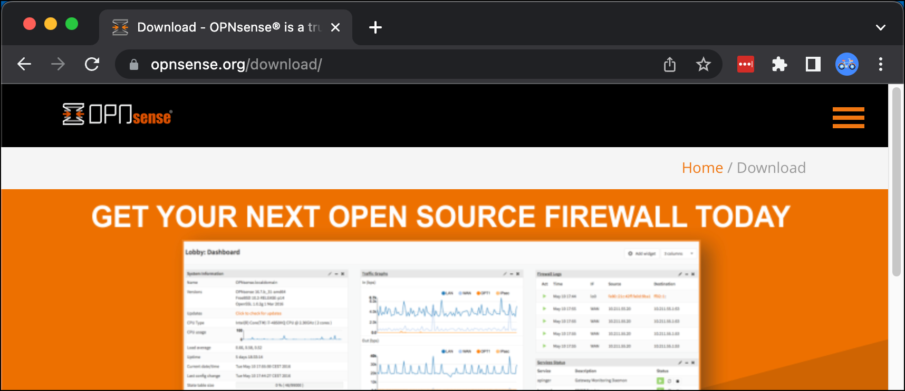
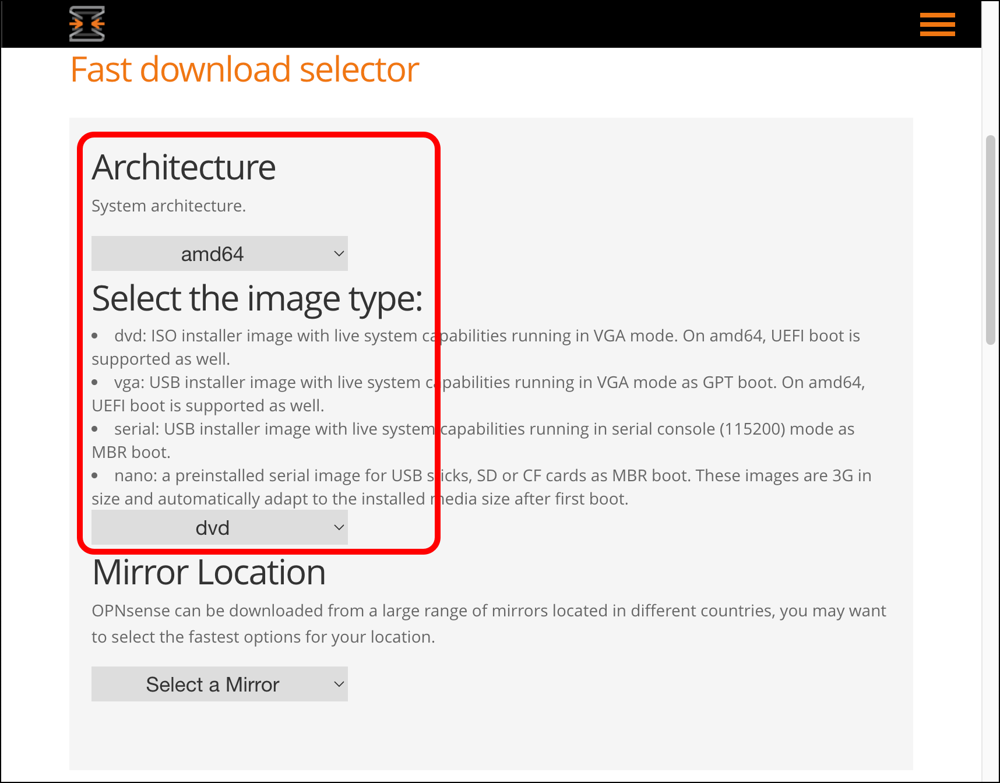
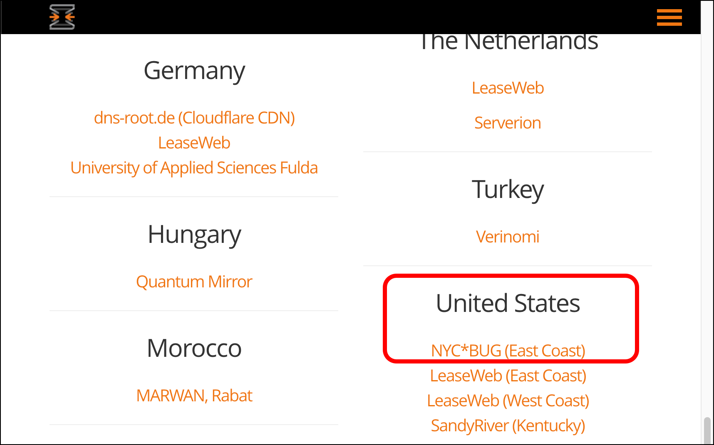
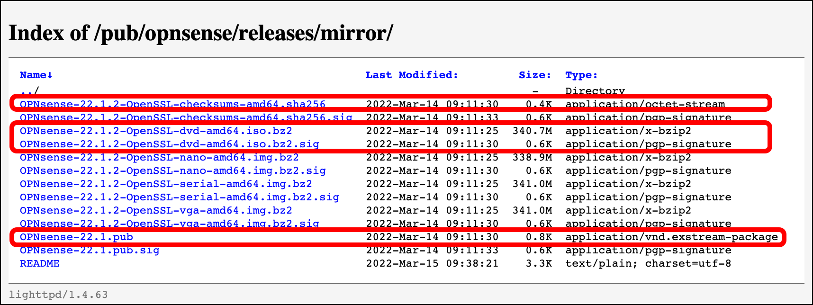
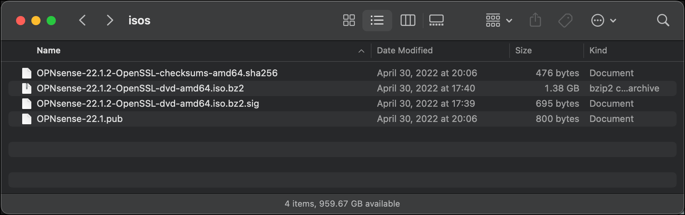
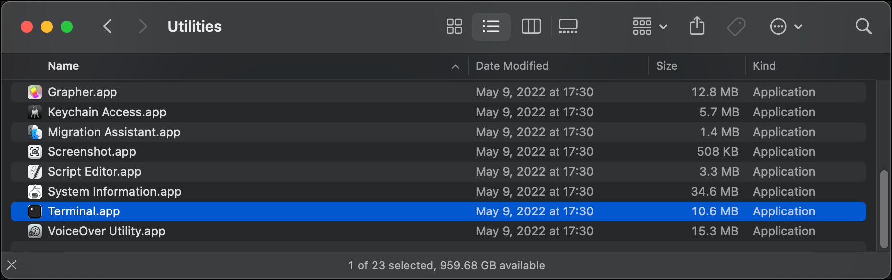
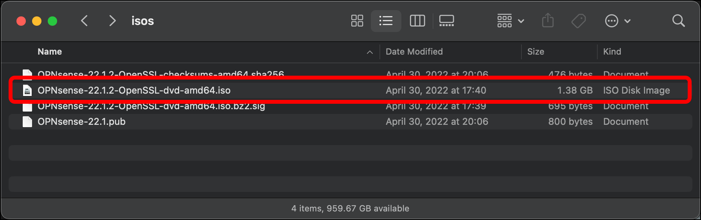
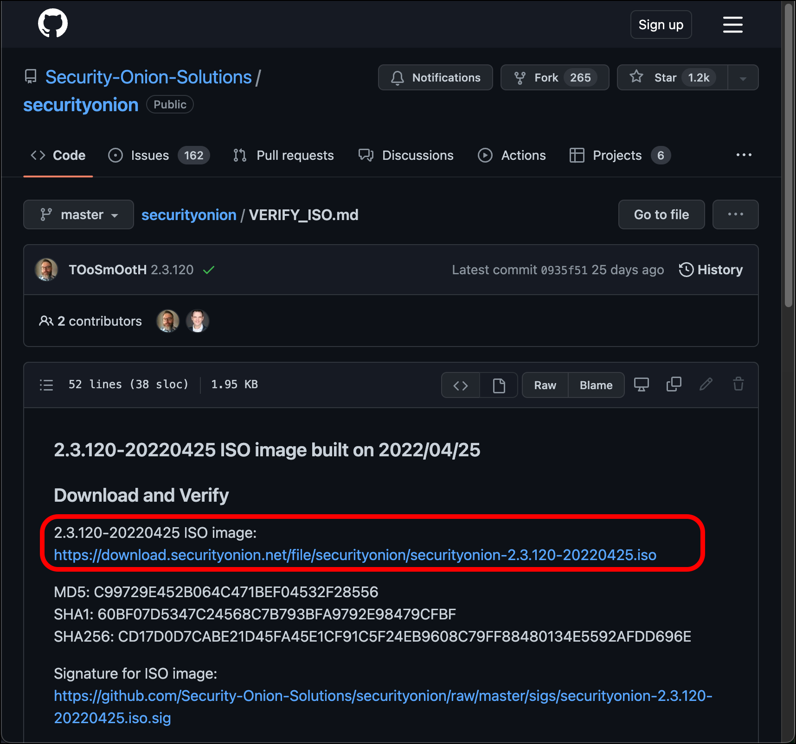
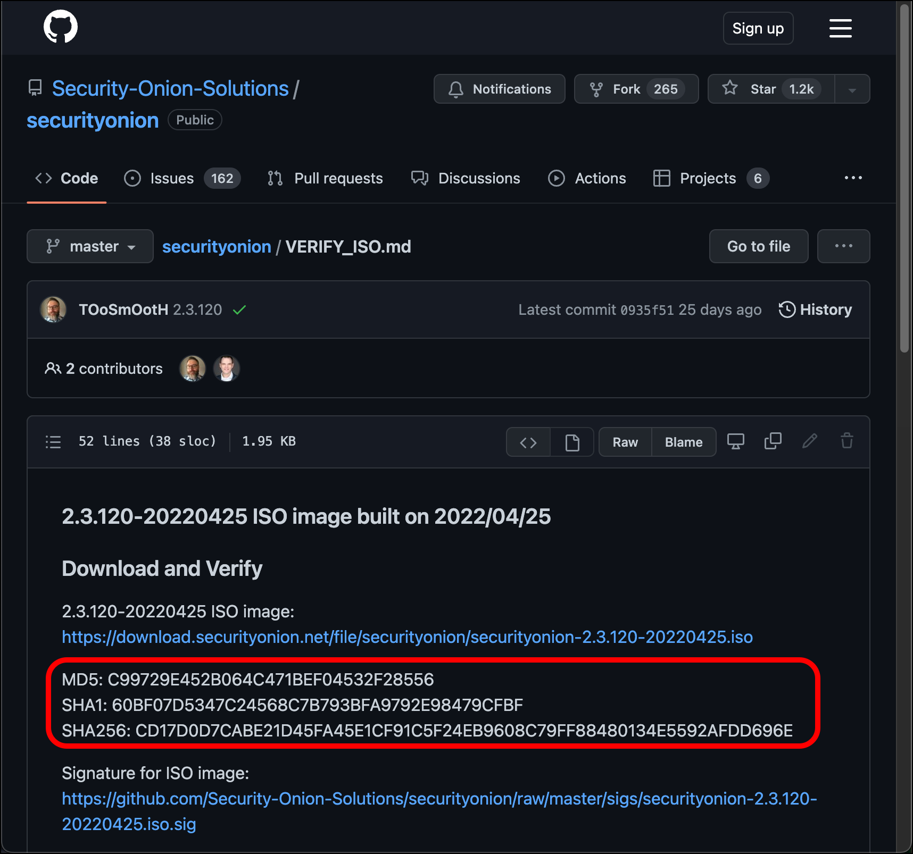

# Prepare OPNsense and Security Onion Installation Media

In this tutorial you will create two virtual machines (VMs): one OPNsense VM to provide routing for virtualized lab networks, and one VM for the Security Onion Installation. After downloading the installation media needed to create those VMs, verify that the installation media is valid.

## Download, Validate, and Prepare the OPNsense Installation Media

1. Open a browser and go to [OPNsense's download page](https://opnsense.org/download/){:target="_blank"}.
   
2. Use the drop-down menus to select your processor **Architecture**. I am using **amd64** and select the media image type. I am using **dvd**.
   
3. Scroll down the page and select the OPNsense mirror where you want to download your media from. I am picking one in the **United States**.
   
4. Download the following files from the mirror's index page:
   

   * `OPNsense-<version-number>-OpenSSL-checksums-amd64.sha256`
   * `OPNsense-<version-number>-dvd-amd64.iso.bz2`
   * `OPNsense-<version-number>-dvd-amd64.iso.bz2.sig`
   * `OPNsense-<version-number>.pub`

5. Move these files from your local machine's download folder into their own folder. I named my folder **isos**.
   
6. Open a command line application. If you are using macOS, you can use the default, **Terminal**, under **Applications** > **Utilities**. You can also install a separate terminal application. I use **iTerm2**.
   
7. On the command line, navigate to the folder where you put the OPNsense files.\
`$ cd isos`
8. This series of commands is used to confirm that you have downloaded the correct public key from OPNsense, and that OPNsense's PKI infrastructure can verify that your download of the OPNsense installation media (`<OPNsense-filename>.iso.bz2`) has not been compromised:

   * `$ openssl base64 -d -in <OPNsense-filename>.bz2.sig -out /tmp/image.sig` - This command should not produce output.
   * `$ openssl dgst -sha256 -verify <OPNsense-version>.pub -signature /tmp/image.sig <OPNsense-filename>.img.bz2` - This command could produce the output `Verified OK`, which indicates that your installation media is safe to use.

9. Unzip the installation media:\
`$ gunzip <OPNsense-filename>.iso.bz2`
10. This creates a new file within the older, `<OPNsense-filename>.iso`.
   

Your OPNsense ISO is ready for installation.

### Download, Validate, and Prepare the Security Onion Installation Media

1. You can download the [current Security Onion ISO from their GitHub](https://github.com/Security-Onion-Solutions/securityonion/blob/master/VERIFY_ISO.md){:target="_blank"}.
   

2. Place the ISO file in the same location that you put your OPNsense files.
3. Confirm the checksum against [Security Onion's GitHub](https://github.com/Security-Onion-Solutions/securityonion/blob/master/VERIFY_ISO.md){:target="_blank"}:\
`$ shasum -a 256 securityonion-2.3.120-20220425.iso` using the hashing algorithm of your choice. (This example uses SHA-256.)
   

Your Security Onion ISO is ready for installation.