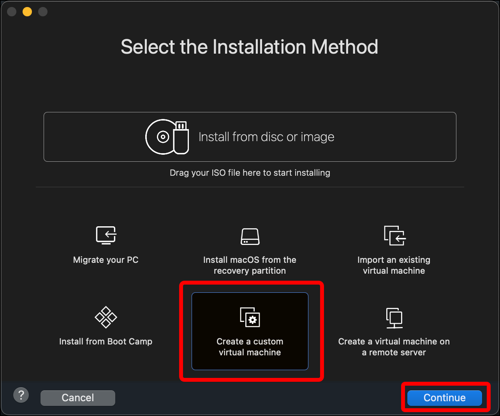
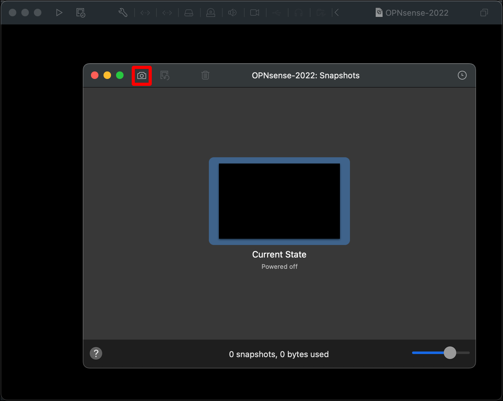

# Create the OPNsense Virtual Machine

1. For this tutorial, I will create my virtual machines (VMs) in a folder called **localLab**. Click the plus icon in the top-left corner of VMware Fusion and select **Folder**.
   
2. Enter the folder name (**localLab**) and press `Enter`.
   
3. Click the plus icon and select **New...**.
   
4. Select **Create a custom virtual machine**, then click **Continue**.
   
5. In the **Choose Operating System** dialog, select **Other**, then select **FreeBSD 12 64-bit** and click **Continue**.
   
6. In the **Choose Firmware Type** dialog you can leave the default of **Legacy BIOS**, but OPNsense's amd64 architecture supports UEFI, so I am selecting that. Click **Continue**.
   
7. In the **Choose a Virtual Disk** dialog, leave the radio button set to **Create a new virtual disk** and click **Continue**.
   
8. On the **Finish** dialog, click **Customize Settings**.
   
9. Change the name of the virtual machine file to something that indicates what it is (such as `OPNsense-2022`) and click **Save** to save it with your other VMware Fusion virtual machines.
   
10. A window for the VM itself and its **Settings** window should open. If the **Settings** window does not open, open it with `Command + E` or click the wrench icon that displays at the top of the window.
   
11. Click **Startup Disk**.
   
12. Select **CD/DVD**. This means that when the VM starts, it will use the installation media in the virtual CD/DVD drive. Click **Show All**.
   
13. Click **CD/DVD (IDE)**.
   
14. Click the drop-down menu and select **Choose a disc or disc image**.
   
15. Navigate to your unzipped OPNsense ISO file in the **isos** directory, select it so that the VM will boot from it, and click **Open**.
   
16. Make sure **Connect CD/DVD Drive** is selected and click **Show All**.
   
17. Click **Network Adapter**.
   
18. Select **Bridged Networking** > **Autodetect** so that your OPNsense VM can connect to the internet through the host operating system's internet connection.
   
19. Click **Add Device...**.
   
20. Click **Network Adapter** and click **Add...**.
   
21. A dialog for **Network Adapter 2** displays. Under **Custom**, select **EXTERNAL_NET_LAN**, then click **Add Device...**.
   

    * **Note:** **EXTERNAL_NET_LAN** is the network you will access OPNsense's web interface for management, and also use Kali to send malicious traffic to **HOME_NET_LAN**.

22. Add a third network adapter by clicking **Network Adapter**, then **Add...**.
   
23. A dialog for **Network Adapter 3** displays. Under **Custom**, select **HOME_NET_LAN**, click **Add Device...**, then click **Show All**.
   

    * **Note:** **HOME_NET_LAN** is the network where you will deploy Security Onion.

24. Click **Processors & Memory**.
   
25. Because this is a small virtual network on the host Mac and we will have only a few VMs and not a lot of traffic, you can use less processing power for the OPNsense router. (You will need it for the other VMs.) Click **Processors** and select **2 processor cores**.
   
26. Change the **Memory** to **1024**.
   
27. You are done configuring your OPNsense VM. You can close the **Settings** window. In the window for the VM itself (the window will be labeled with what you named the VM when you saved it), click the icon next to the playhead in the top-left corner of the window. (If you hover over the icon, it will display the text **Manage this virtual machine's snapshots**.
   
28. In the **Snapshots** window, click the camera icon towards the top-left corner.
   
29. Give your snapshot a name and description (for example, **v0_pre_boot**) and click **Take**. A snapshot allows you to roll back to the VM's state at the time of the snapshot. If anything goes wrong, you can roll back to this snapshot and start over but still skip the above steps.
   
30. When you are done you can close the **Snapshots** window.
   
31. In your Virtual Machine library, select your OPNsense VM and drag it into the **localLab** folder.
   

You are ready to boot your OPNsense router VM and configure it to handle the traffic for your local lab.