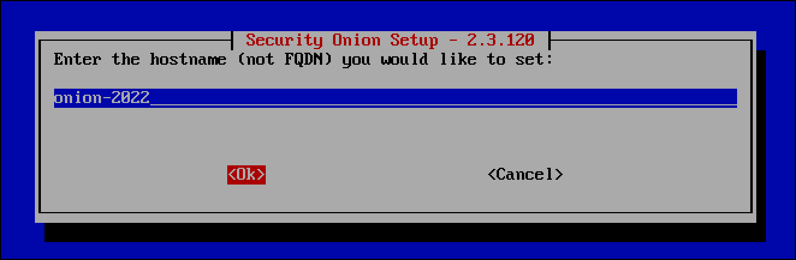
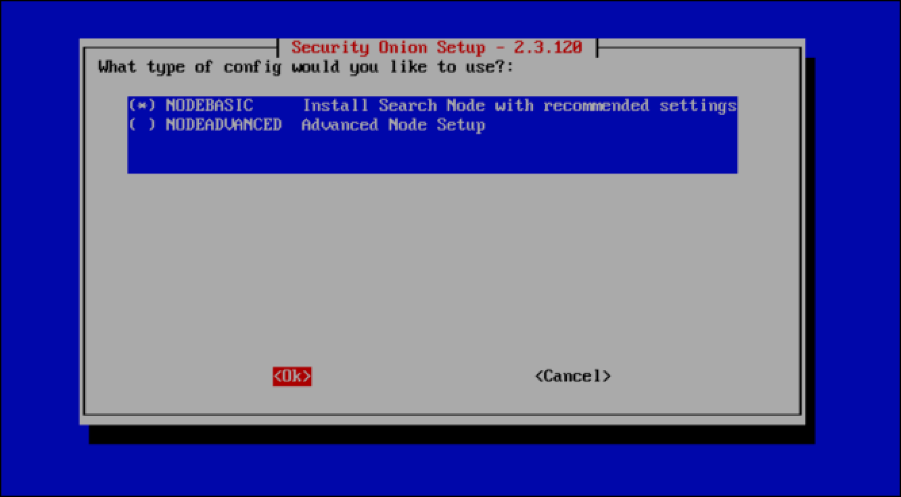

# Configure the Security Onion Virtual Machine

1. Start the VM by clicking the playhead icon or from the **Virtual Machine** menu.
   
2. Select **Install Security Onion \<version\>** when the Security Onion prompt screen loads.
   
3. Press `Enter` at the prompt to begin installation.
   
4. There is a drive-erasure warning. Type `yes` and press `Enter`.
   
5. Enter an administrative username for the CentOS 7 operating system that will run Security Onion.
   
6. Set an administrative password and press `Enter`.
   
7. Re-enter the administrative password and press `Enter`.
   
8. The output represents the installation of the base CentOS 7 operating system. It will take about 10 minutes. When you see the `Initial Install Complete` prompt, press `Enter`.
   
9. When the VM comes online, log in with the new credentials you created for the VM.
   
10. The setup wizard should start automatically. Select **Yes** to continue.
   
11. Leave **Install Run the standard Security Onion installation** and use the tab key to select **Ok** then press `Enter`.
   
12. **EVAL** is selected by default. While the evaluation installation should work for the defined use case, use the down arrow key to select **STANDALONE**, which is a production installation of a single Security Onion host, then select **OK** and press `Enter`.
   
13. Type `agree` to agree to the terms of the Elastic license, then select **OK**.
   
14. Give your Security Onion deployment a name and select **OK**.
   
15. You can also enter a short description for your Security Onion, or just leave it blank, select **OK** and press `Enter`.
   
16. You are prompted to select the **management NIC**. As we did with the OPNsense VM, use the VM's **Network Adapter** settings to confirm the MAC address for the correct network adapter. In this case, I am choosing **ens33**, which has a MAC address ending in **39:54**, which matches the first network adapter on the VM, which I have in bridged mode. In the Security Onion setup wizard, use the spacebar to select **ens33**, then select **OK**.
   
17. Because I don't have a real management network and I am connecting the management interface to my home, physical network which already uses DHCP addressing, I use the down arrow key and spacebar to select **DHCP** and then select **OK**.
   
18. If you select DHCP, you will get a warning from Security Onion reminding you that a DHCP-assigned address could change, and you might have problems connecting to the management interface of Security Onion. This is not an issue in my case, so I select **Yes** to keep DHCP.
   
19. Select **OK** when you see **Setup will now initialize networking** and press `Enter`.
   
20. Since we are not airgapping this system or this network, leave **Standard** selected and select **OK**.
   
21. When asked **How would you like to connect to the Internet?** I select **Direct** since I am not using a proxy.
   
22. A progress bar displays.
   
23. When asked to select the **Monitor Interface**, I only have one option, which matches with the VM network adapter connected to the HOME_NET_LAN. This is what I want, so I select **ens34** and proceed.
   
24. For **Choose OS patch schedule**, leave **Automatic** selected and select **OK**.
   
25. The field for **your home network(s)** is prepopulated with RFC1918 IP addresses using CIDR notation. Since this Security Onion will monitor a single network created with VMware Fusion Pro and the OPNsense VM, HOME_NET_LAN, clear the default values. (You can use `Control` + `u`.) Then enter the IP address range for the HOME_NET_LAN using the correct CIDR notation: **10.10.10.0/24**, select **OK** and press `Enter`.
   
26. Keep the default manager type, **Basic**, selected, select **OK** and press `Enter`.
   
27. When you are prompted for which tool you want to generate metadata, keep **Zeek** selected, select **OK** and press `Enter`.
   
28. You are asked to select the ruleset that Suricata will use to detect malicious activity on the network. Keep **ETOPEN** selected since it is a free, open-source ruleset, then select **OK** and press `Enter`.
   
29. Security Onion lets you choose whether or not you want to run additional, optional services. The understanding is that more services use more RAM, and you can deselect some of the services to conserve resources. All items are selected by default. You can use the spacebar to unselect items, then select **OK**.
   
30. Select **Yes** to keep the default Docker IP range.
   
31. Enter an email address. The email address only acts as the username for the account that you will use to log in to the Security Onion dashboard. It will not send emails to this address. So you can use **email@email.com**.
   
32. Enter a password for this Security Onion account.
   
33. Enter the password again.
   
34. The wizard asks if you want to use an IP address or a hostname to navigate to the Security Onion Console. This example skips the management network approach and am assigns the Security Onion management NIC an IP address on my home network, so I leave **IP** selected and then select **OK**.
   
35. You are prompted to set a password for the **soremote** user, which you would use in a distributed deployment of multiple Security Onion hosts. Select **OK**.
   
36. Enter a password for the **soremote** account.
   
37. Enter the password again.
   
38. When asked for the type of configuration you want for you Security Onion deployment, keep **Basic** selected, then select **OK** and press `Enter`.
   
39. You are prompted for the number of **Zeek processes** that you want running. Because this is for demonstration and I don't want it to consume too many resources, I leave the default of **1**.
   
40. Leave the number of **Suricata processes** at **1**.
   
41. Select **Yes** to **configure ntp servers**.
   
42. Leave the default NTP servers and select **OK**,
   
43. Leave the **config** type of **NODEBASIC Install Search Node with recommended settings** defaults and select **OK**.
   
44. The **so-allow** command opens up the management interface of your Security Onion installation to an IP address range from which clients can navigate to the web management interface or connect over SSH. Select **Yes**.
   
45. Because I am using my home network as the "management network," I enter **192.168.1.0/24** in CIDR notation so that devices on that network can navigate to the Security Onion web management interface.
   
46. The final pane summarizes all of the options you have configured and gives you the choice to accept these configurations and proceed.
   
47. Use the down arrow key if you want to scroll to the bottom of the pane to see all of the information. When you are done, use the `Tab` key to select **Yes** and press `Enter` to complete the Security Onion installation.
   
48. A progress bar displays Security Onion installation phases. In my experience, the process takes at least 20 minutes to complete, depending on host system resources.
   
49. When the process is complete, you see a confirmation message saying that the installation succeeded. It also provides the URL you use to access the Security Onion Console. Press `Enter` to select **OK** and reboot the VM.
   

**Note:** Consider shutting down the Security Onion VM and taking a snapshot.