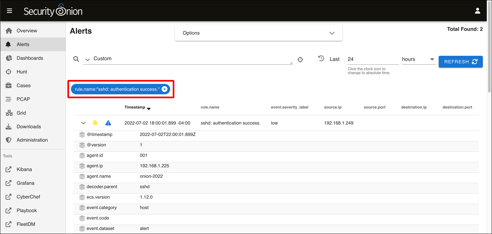

# Using Security Onion and the Security Onion Console

This section provides a basic overview of how you can use Security Onion. Security Onion can do so much, and that is all out of scope for this tutorial, though I hope to fill in the gaps later. This section provides a quick introduction to the Security Onion Console and in particular its **Alerts** page and how to use it.

## Interacting With Security Onion and the Security Onion Console

Now that you have installed Security Onion and connected it to the HOME_NET_LAN network, it's time to boot it up, log in to the Security Onion Console from the management network, and start to learn about Security Onion and some of its tools.

You interact with Security Onion in two ways: through the command line of the CentOS virtual machine (VM), and through your web browser using the Security Onion Console. In both cases, you are connecting to the VM's network adapter that you assigned for the "management network." In my case, I connected that network adapter to my home network, bridged through the Mac host operating system.

There are two ways to access the command line:

* Using the VMware Fusion Pro console window (which I have used throughout these tutorials).
* By connecting to the VM using SSH. In my case, I do that on the Mac host operating system using the IP address of the Security Onion VM network on my home network (the management network). To do so, you need the IP address of the VM on the management network and the credentials you created for the VM during initial installation.

  1. `$ ssh <username>@<management-network-ip-address>`
  2. Enter your password.

If you use SSH keys for authentication, you can add your SSH key pair to the Security Onion VM so you can log in without using a password:

1. `$ ssh-copy-id -i ~/.ssh/<public-key-name>.pub <username>@<management-network-ip-address>`
2. Enter your password.

## Start Using Security Onion and the Security Onion Console

1. When Security Onion reboots after installation, you will see the login prompt with the hostname you gave to the system. Enter the CentOS system credentials that you set for the VM during initial installation.
   
2. When you successfully log in, a banner displays the URL to use for accessing the Security Onion Console on the management network. The first thing you want to do is run the `sudo so-status` command to determine the status of Security Onion.
   
3. The output of `sudo so-status` is a color-coded breakdown of all the Docker containers that make up Security Onion. I run this command until I see all containers are green and `OK`, which can take several minutes depending on processor and memory resources available to the Security Onion VM.
   
4. Open your browser of choice and enter the URL from the login banner and enter it into the browser. Check the address bar to make sure that the URL starts with `https://`.
   
5. Your browser will display a self-signed certificate warning (**NET::ERR_CERT_AUTHORITY_INVALID**). Click **Advanced**.
   
6. Click **Proceed to \<Security-Onion-URL\>**.
   
7. Enter the email address and password that you entered during Security Installation configuration on the **Login to Security Onion** page and click **Login**.
   
8. The Security Onion **Overview** page loads with some introductory text about Security Onion and how to customize this page. In the left sidebar are links to:
   

   * The **Overview** page.
   * The **Alerts** page where you can review detections on your network.
   * A **Dashboards** page for visualizing Security Onion data.
   * The **Hunt** page, where you can compare different events as part of investigations and incident response.
   * The **Cases** page. "Cases" are events that you can create when browsing the **Alert**, **Dashboard**, or **Hunt** pages.
   * The **PCAP** page for capturing and replaying packet captures (PCAPs).
   * The **Grid** page lets you check the operational status of the Security Onion host (in a standalone deployment) or all of your Security Onion hosts (in a distributed deployment).
   * The **Downloads** page
   * The **Administration** page is where you can manage user accounts to access the Security Onion Console.
   * Additional **Tools** that extend what you can do with Security Onion:

      * A **Kibana** instance that provides security information and event management (SIEM) functionality.
      * **Grafana** provides visualizations of the state of your Security Onion system, with near-real-time reporting of both high-level and very granular system properties, as well as other statistics, such as network activity.
      * **CyberChef** is an open-source project from Britain's GCHQ, that describes itself as "The Cyber Swiss Army Knife -- a web app for encryption, encoding, compression and data analysis."
      * **Playbook** is a tool that allows you "to create a Detection Playbook, which itself consists of individual Plays. These Plays are fully self-contained and describe the different aspects around a particular detection strategy."
      * **FleetDM** is a tool that "asks questions about your servers, containers, and laptops running Linux, Windows, and macOS."
      * **Navigator** lets you walk through the steps of an attack using the MITRE ATT&CK Framework.

9. Click **Alerts**.
   
10. The **Alerts** page loads with a table of events that it has detected. Since this is a fresh install on a network with no traffic, all of these alerts are related to the Security Onion VM itself and are rated as having a low severity. 
   
11. Each individual alert type is grouped by its name, and also by the module, or the detection engine. In this case, the **event.module** for all alerts is **ossec**. These events are being detected by another piece of software that Security Onion leverages called Wazuh, a host-based intrusion detection system. (The name **ossec** refers to a Wazuh predecessor, OSSEC.) This means Wazuh is installed on our Security Onion VM and is monitoring for potentially malicious activity.
   
12. As suggested by the severity level, these are all routine events. Hover over **sshd authentication success** (with a count of two alerts) and click its row.
   
13. A menu appears. Click **Drilldown**.
   
14. This table displays the individual alerts with the name **sshd authentication success**. Click the arrowhead to twirl down an individual event.
   
15. Scroll down the page to see all of the metadata that Wazuh collected and reported about this event. If you look at the message, you can see that this event was generated when I SSH'd into Security Onion from my host Mac using my SSH key for authentication.
   
16. Scroll back up to the top of the table. Notice the bubble that says **rule.name:"sshd: authentication success."**. This indicates that all the alerts you see are filtered by this rule name. Click the **x** to remove this filter.
   
17. When you see the **Alerts** table reload, it looks different. You see all of the individual rules, and the word **Ungroup** in the text field above. This is the query field where you can enter Security Onion queries to search through your alerts.
   
18. If you click the down arrow next to the query field, you will see several predefined queries, including the default one that was selected when you first came to the **Alerts** page, **Group by Name, Module**. Select this query.
   
19. You are back where you started, with several uninteresting alerts. In the next article, we are going to try and generate our own, more interesting, alerts using the Kali VM to generate malicious traffic for Security Onion to detect.
   
