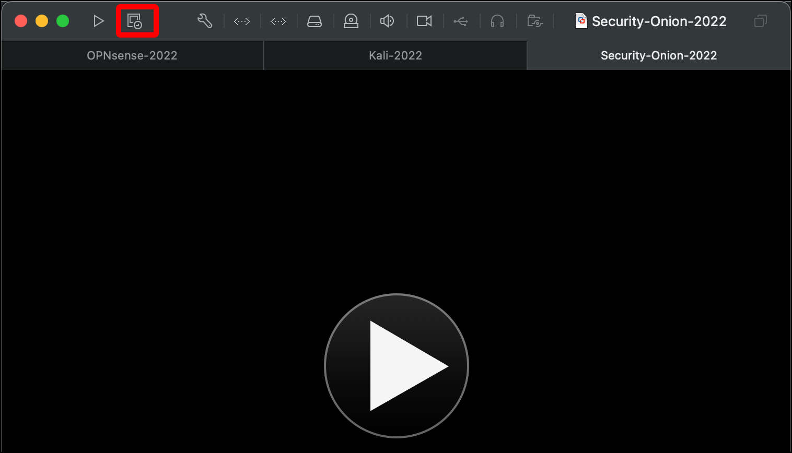

# Create the Security Onion Virtual Machine

Now it's time to create the Security Onion virtual machine (VM).

1. In the VMware Virtual Machine Library, click the **plus (+)** icon and select **New...**.
   
2. Click **Install from disc or image** on the **Select the Installation Method** pane, then click **Continue**.
   
3. Click **Use another disc or disc image...**.
   
4. Use Finder to select the Security Onion ISO you downloaded and click **Open**.
   
5. In the **Create a New Virtual Machine** pane, click **Continue**.
   
6. In the **Choose Operating System** dialog, select **Linux** and **Centos 7 64-bit** and click **Continue**.
   
7. For **Choose Firmware Type**, leave the default **Legacy BIOS** and click **Continue**.
   
8. On the **Finish** dialog, click **Customize Settings**.
   
9. Change the name of the virtual machine file to something that indicates what it is (such as `Security-Onion-2022`) and click **Save** to save it with your other VMware Fusion virtual machines.
   
10. A window for the VM itself and its **Settings** window should open. Click **Processors & Memory**. (If the **Settings** window does not open, open it with `Command + E`.)
   
11. Click the **Processors** drop-down and select **4 processor cores**.
    

    * **Note:** Four cores is the minimum requirement for Security Onion. If your setup allows you to assign more to Security Onion, consider  doing so.

12. Change the memory to **12288**, representing 12GB of RAM, then click **Show All**.
    

    * **Note:** Twelve gigabytes of RAM is the minimum requirement for Security Onion. Realistically you will want more. With my current computer, this is pretty much the maximum I can allocate to the Security Onion VM. After installation and configuration I may even draw down some of the RAM allocation. If your setup allows you to assign more RAM to Security Onion, consider doing so.

13. Click **Network Adapter**.
    
14. This is the Security Onion VM's first network adapter. This should be attached to the management network, where users (security analysts) can access and manage Security Onion using its web interface, the Security Onion Console, or using the command line via SSH. My environment doesn't have a management network, so for now I will select **Bridged Networking** > **Autodetect**. This option adds the VM to my home network with its own IP address so that my host system Mac can reach it, though it is really sharing the Mac's network connection.
    
15. Security Onion requires another network adapter, so click **Add Device...**.
    
16. Click **Network Adapter** and click **Add...**.
    
17. A dialog for **Network Adapter 2** displays. Under **Custom**, select **HOME_NET_LAN**. This will allow Security Onion to "sniff traffic" on our LAN we created for the lab. When you are done, click **Show All**.
    
18. Click **Hard Disk (SCSI)**.
    
19. Set the **Disk size** to **200.00 GB** and click **Apply**.
    
20. You are done configuring your Security Onion VM. You can close the **Settings** window and open the **Snapshots** window.
    
21. In the **Snapshots** window, click the camera icon in the top-left corner.
    
22. Give your snapshot a name (such as **v0_pre_boot**) and click **Take**. If anything goes wrong, you can roll back to this snapshot and start over while skipping the VM creation steps. When you are done close the **Snapshots** window.
    

In the next section you will boot the Security Onion VM, install the operating system and Security Onion, and configure Security Onion.